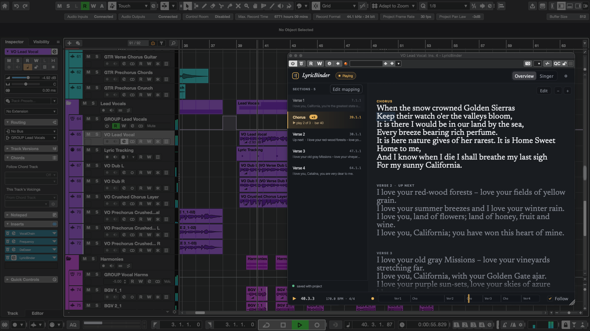
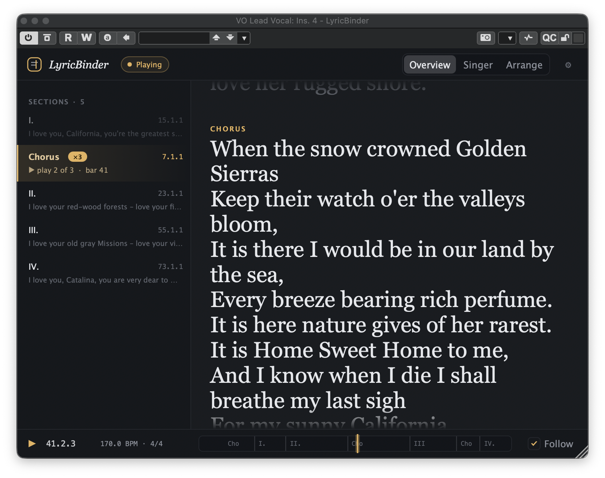
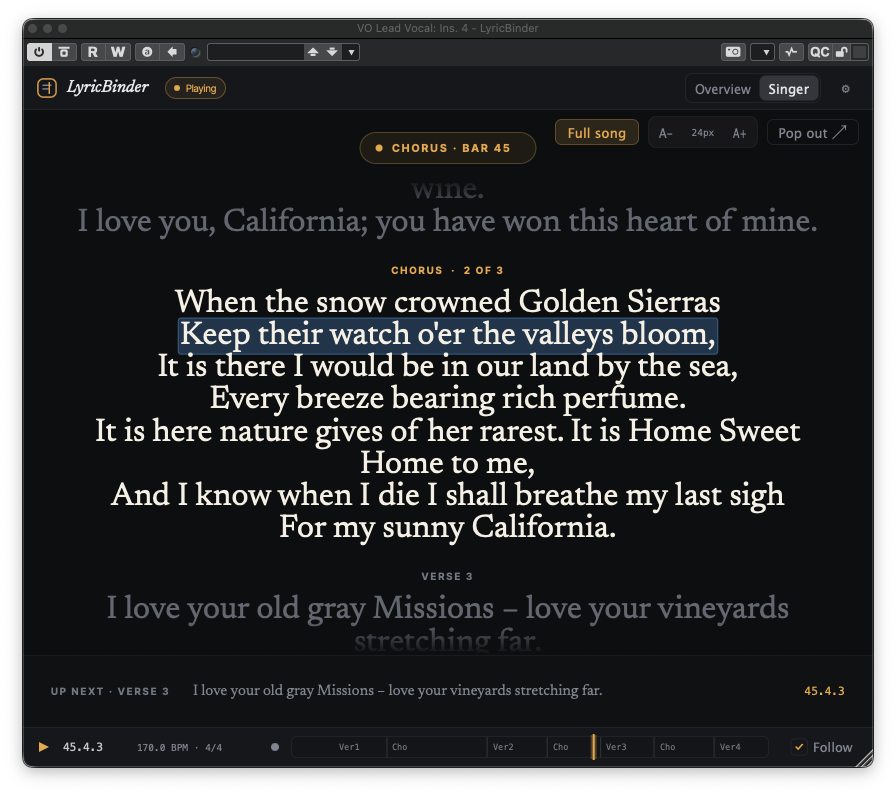
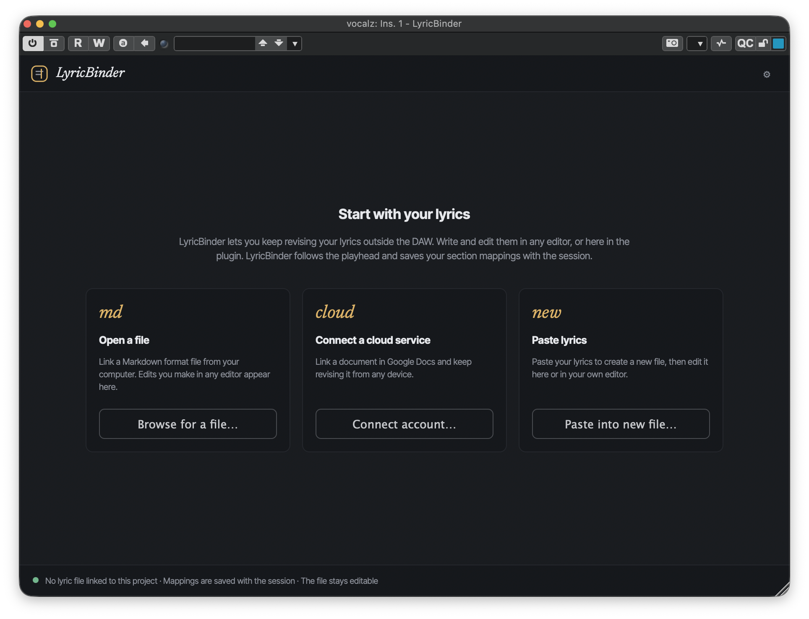
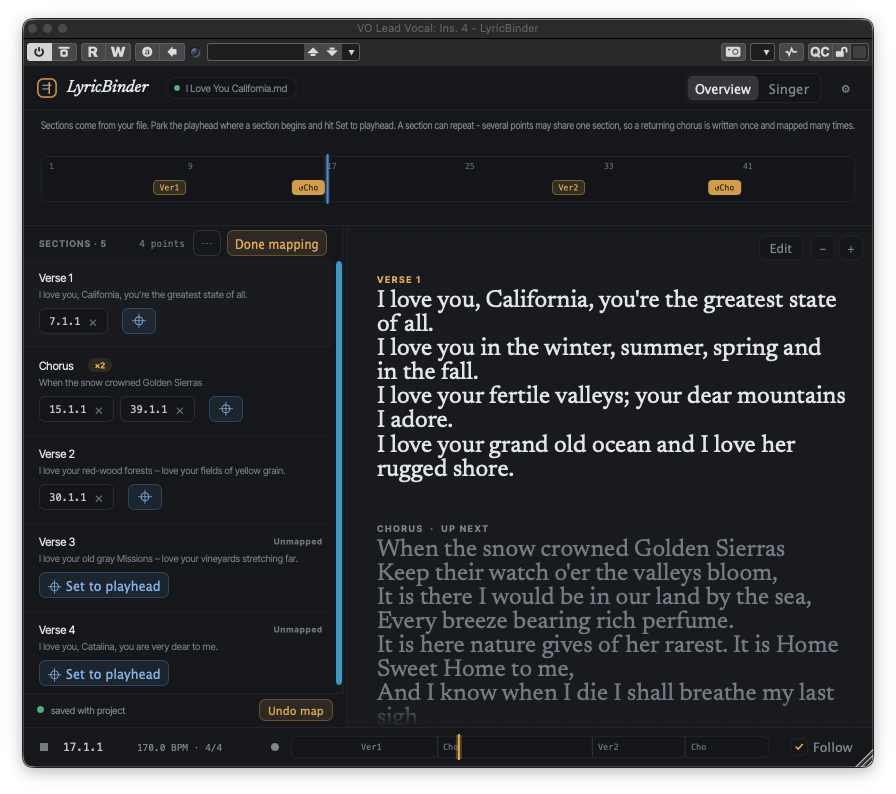
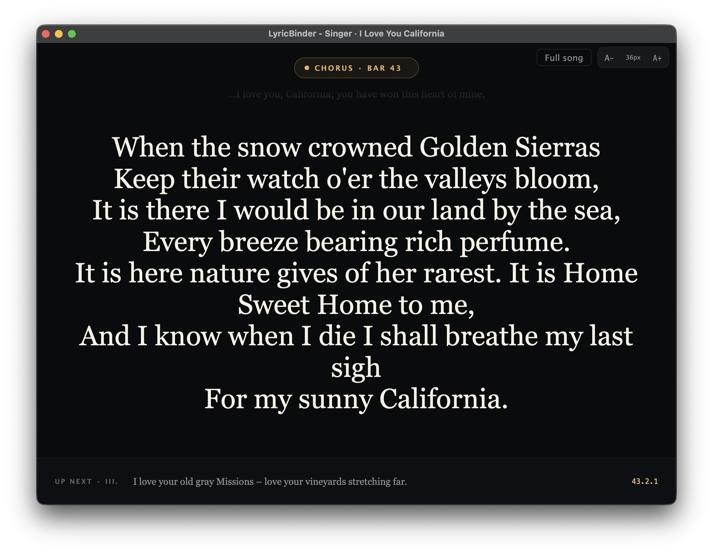

<!-- Replace with your logo/wordmark. Recommended ~480px wide, transparent PNG. -->

### Your lyrics, synced to the transport — right inside your DAW.

LyricBinder turns lyrics you already wrote — a Markdown file, or a Google Doc —
into a live, auto-scrolling display that follows your session's playhead. Map
each section to a bar, hit play, and the words keep pace with the music.

[**⬇ Download the latest beta**](https://github.com/ttpenguins/LyricBinder-releases/releases/latest) &nbsp;·&nbsp; [Install guide](#-installing-the-beta) &nbsp;·&nbsp; [Features](#-features)

<!-- Hero shot: the Singer view scrolling during playback is the strongest first impression. -->

---

## What it is

LyricBinder is a lightweight **VST3 and AU plugin** that reads your DAW's transport —
bar, beat, tempo, play state — and shows the right lyrics at the right moment. It
does **not** process audio and adds no latency to your signal path. Think of it
as a teleprompter that knows exactly where you are in the song.

You keep authoring lyrics wherever you already do. LyricBinder watches the file
and updates the moment you save — no re-importing, no copy-paste.

---

## ✨ Features

### 🎵 Follows your playhead
Reads bar/beat/tempo straight from the host. The current section scrolls into view
as playback moves through the arrangement, and catches up within about a second and
a half no matter where you jump. Autoscroll setup lets you dial in a marker offset
(switch focus to the upcoming section a little early) and a scroll speed —
Immediate, Fast, Medium, or Slow.

### 🎹 MIDI-driven Follow Modes (BETA)
Go beyond section-level tracking: send keyswitches (or just play the melody) to
highlight the exact line — or the exact word — the singer should be on next, with
a dedicated Clear Highlight keyswitch to hide it mid-section without losing your
place. Verified in Cubase; Logic Pro receives it via LyricBinder's AU Music Effect
routing. Ableton Live's audio inserts can't receive MIDI at all, so Live gets
section-level Marker mode only — that's a Live limitation, not a LyricBinder one.

### 📝 Bring your own lyrics
Point it at a **Markdown file** on disk, or connect a **Google Doc**. Sections are
just your `##` headings. Edit the source in your favourite editor (or use the simple included
editor to make changes in the plugin) and LyricBinder picks up the change live — it's watching 
the file, not a stale import.

### 🎯 Map sections to bars
Toggle **Edit mapping** in the Overview rail to pin each section to where it lands
in the song. Repeats are supported — the same chorus can appear at several bars —
and anything left unmapped is flagged so nothing silently falls out of sync. Drag
the rail divider to resize, zoom the lyric text independently of the rail, and use
Insert/Cut Time to shift or remove a run of markers in one move.

### 🎤 Singer view (a real teleprompter)
A big, clean, distraction-free display for tracking vocals. Bump the font size,
switch to full-song mode, or **pop it out into its own window** and drag it to a
second screen or an iPad-as-display.

### 🧭 Two ways to work
| View | For |
|------|-----|
| **Overview** | Everyday tracking in a small plugin window, allows mapping of sections |
| **Singer** | Full-screen teleprompter, inline or detached |

### 🎨 Fits your setup
Light and dark themes, adjustable heading levels, and a "clean text" toggle that
renders Markdown as plain lyrics when you don't want to see the formatting.

### 💾 Tracks unsaved changes
Mapping edits, source changes, and display tweaks mark your host project dirty,
so your DAW prompts you to save before closing — nothing gets lost silently.

### 🔔 Stays current
An in-plugin notice tells you when a new beta is available and links straight to
the download — the plugin never installs anything itself.

### 🔒 Private by default
Optional, anonymous usage stats are **off unless you turn them on**, and can be
switched back off any time from **About**. They never include your lyrics, file
names, or account — see [Privacy](#-privacy) below.

---

## ⬇ Installing the beta

LyricBinder is signed and notarized by Apple, so it installs like any other Mac
app — no security workarounds needed.

**Requirements:** macOS 15 (Sequoia) or later · Apple Silicon or Intel · a
**VST3** host (Cubase, Ableton Live, Reaper, Studio One) or an **AU** host
(Logic Pro, GarageBand). *Windows and AAX are not in this beta.*

1. Download **`LyricBinder_<version>.pkg`** from the
   [latest release](https://github.com/ttpenguins/LyricBinder-releases/releases/latest).
2. Double-click it and follow the prompts. You'll be asked to authenticate, since
   the plugin installs to a system folder.
3. Rescan plugins in your DAW and add **LyricBinder** on any track (i.e. Lead Vocal).

If macOS blocks the installer or says it can't verify the developer, that's not
expected — re-download it and, if it happens again, let us know.

The installer includes the plugin and an uninstaller. To remove LyricBinder, run
the bundled uninstaller.

---

## 🚀 Quick start

1. Add LyricBinder to a track and open its window.
2. Click **Link** and choose a Markdown file (or connect a Google Doc). Use `##`
   for each section heading.
3. Click **Edit mapping** and map your sections to their bars.
4. Turn on **Follow**, press play, and watch the lyrics track the transport.
5. For live tracking, open **Singer** view and pop it out to a second screen.
6. Want line- or word-level highlighting? Open the gear menu → **Follow** and
   pick a Keyswitch or Melody mode.

---

## 🔒 Privacy

LyricBinder can share a small, anonymous record of *which features get used* — for
example, that a file was linked or the Singer view was opened — to help guide what
gets built next. It is **opt-in**: nothing is sent unless you say yes, and you can
turn it off again any time from **About**.

It **never** sends your lyrics, section names, file names or paths, your Google
account, or any document contents. You're identified only by a random ID generated
on your machine, which is deleted if you opt out. Analytics data is stored in the
United States.

---

## Status

LyricBinder is in **open beta** on macOS (VST3, AU), signed and notarized by
Apple. Coming next: AAX and Windows versions.

*Source is maintained privately; this repository hosts the public releases and
installers.*
